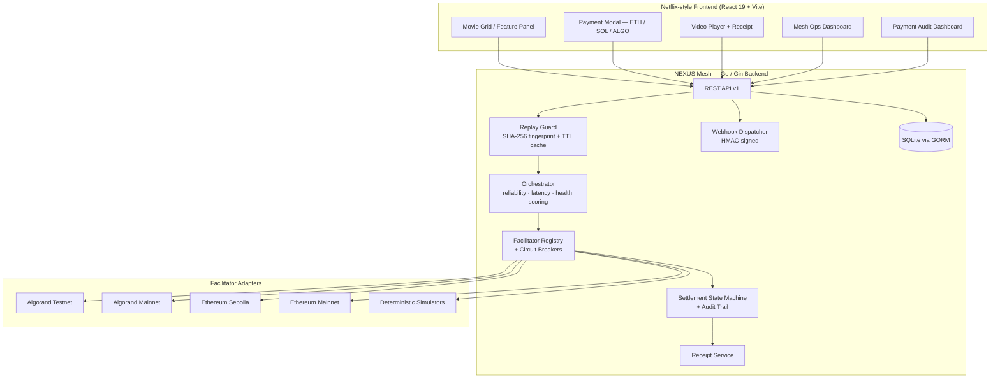

<div align="center">


# OmniMesh

### x402 Payment Verification & Settlement Mesh

**A non-custodial, multi-chain payment routing engine for the HTTP 402 economy — demonstrated through a pay-per-view streaming app.**

[](nexus-mesh-go)
[](frontend)
[](nexus-mesh-go/internal/api)
[](https://github.com/coinbase/x402)
[](#license)

</div>

---

## What is this?

**OmniMesh** is a settlement layer for the [x402](https://github.com/coinbase/x402) protocol — the emerging standard that revives the long-dormant `HTTP 402 Payment Required` status code to let APIs and content gate access behind a machine-payable price tag.

Most x402 demos wire a client straight to a single facilitator on a single chain. OmniMesh instead sits in the middle as a **mesh**: it can register many facilitators (real blockchain nodes *and* deterministic simulators) across multiple networks, score them continuously on latency/reliability/health, route each payment to the best candidate, trip a circuit breaker when one misbehaves, and hand back a cryptographically receipted, fully audited settlement — all without ever taking custody of user funds.

To make the mesh tangible, it ships with a **Netflix-styled streaming front end**: browse a catalog, hit play, get a `402`, pay in ETH / SOL / ALGO through a wallet-style modal, and the video unlocks — with a live operations dashboard and a payment audit trail sitting one click away.

<div align="center">

| Browse & Pay | Live Mesh Ops | Payment Audit Trail |
|:---:|:---:|:---:|
| Netflix-style catalog with a 402 paywall | Facilitator health, circuit state, scoring | Per-payment settlement timeline |

</div>

---

## Table of Contents

- [Why a mesh, not a single facilitator?](#why-a-mesh-not-a-single-facilitator)
- [Architecture](#architecture)
- [Feature highlights](#feature-highlights)
- [Tech stack](#tech-stack)
- [Project structure](#project-structure)
- [Getting started](#getting-started)
- [API reference](#api-reference)
- [Configuration](#configuration)
- [Roadmap](#roadmap)
- [License](#license)

---

## Why a mesh, not a single facilitator?

x402 leaves *who actually settles the payment* up to the implementer. OmniMesh treats that as a routing problem instead of a hardcoded dependency:

- **Multiple facilitators per network** — a "real" on-chain facilitator and a deterministic simulator are registered side by side for Algorand (testnet + mainnet) and Ethereum (Sepolia + mainnet), so the mesh degrades gracefully instead of failing outright.
- **Composite scoring** — every facilitator is scored on a rolling window of reliability (45%), latency (35%), and health-check status (20%), with simulators capped below real facilitators so they're only ever a fallback.
- **Per-network circuit breakers** — a facilitator that trips its failure threshold is marked `OPEN` and taken out of rotation until a recovery timeout passes, then probed via `HALF_OPEN` before being trusted again.
- **Replay protection** — every payload is fingerprinted with SHA-256 before it touches a facilitator, so duplicate submissions are rejected before they cost anything.
- **Full audit trail** — each payment is tracked as a `TraceRecord` through `PENDING → VERIFIED → SETTLING → SETTLED/FAILED`, exportable via a single audit endpoint.

## Architecture



**Flow in short:** the frontend requests protected content → the mesh replies `402 Payment Required` with an x402 payment template → the user signs a payload in the payment modal → the mesh fingerprints it, scores available facilitators for that network, routes it through the winner, records every state transition, issues a receipt, and unlocks the content.

## Feature highlights

**Settlement mesh (`nexus-mesh-go`)**
- Multi-chain facilitator registry — Algorand (testnet/mainnet) and Ethereum (Sepolia/mainnet), each with a real adapter and a simulator fallback
- Weighted, continuously-updated facilitator scoring with per-network routing rules
- Circuit breaker per facilitator (`CLOSED` → `OPEN` → `HALF_OPEN`)
- SHA-256 payload fingerprinting with TTL-based replay protection
- Settlement state machine with a full, exportable audit trail
- Hosted **Checkout API** — merchant registration, API-key-authenticated session creation, hosted pay page, HMAC-signed webhook delivery on completion
- Tamper-evident receipt issuance

**Streaming demo (`frontend`)**
- Netflix-inspired dark UI (React 19 + Tailwind CSS v4) with a feature-spotlight hero panel
- `402`-driven paywall: content is invisible until a receipt is presented
- Multi-chain payment modal (ETH / SOL / ALGO) with simulated wallet signing
- **Mesh Ops Dashboard** — live facilitator health, circuit state, and p50 latency
- **Payment Audit Dashboard** — real-time per-payment settlement timeline, auto-refreshing every 3 seconds

## Tech stack

| Layer | Technology |
|---|---|
| Backend framework | Go 1.22, [Gin](https://github.com/gin-gonic/gin) |
| Persistence | SQLite via [GORM](https://gorm.io) |
| Chain SDKs | `go-algorand-sdk/v2`, `go-ethereum` |
| Frontend framework | React 19 + Vite 8 |
| Styling | Tailwind CSS v4 |
| HTTP client | Axios |
| Icons | Lucide React |
| Routing (frontend) | React Router 7 |

## Project structure

```
OmniMesh_x402_Payment_Verification_and_Settlement_Mesh/
├── nexus-mesh-go/                  # Go settlement mesh (port 8001)
│   ├── cmd/server/main.go          # Entry point: registers facilitators & routing rules
│   └── internal/
│       ├── adapters/               # Algorand / Ethereum / simulator facilitators
│       ├── api/                    # Gin routes: mesh, checkout, content, payments
│       ├── config/                 # Env-driven configuration
│       ├── middleware/             # API-key auth for checkout sessions
│       ├── orchestrator/           # Facilitator scoring loop
│       ├── receipt/                # Receipt issuance
│       ├── registry/               # Facilitator registry + circuit breakers
│       ├── replay/                 # Replay-attack guard
│       ├── settlement/             # Settlement state machine + audit log
│       ├── store/                  # GORM models & DB init
│       └── webhook/                # HMAC-signed webhook dispatch
│
└── frontend/                       # React + Vite demo app (port 5173)
    └── src/
        ├── App.jsx                 # Shell, feature panel, modal orchestration
        ├── components/
        │   ├── MovieGrid.jsx
        │   ├── PaymentModal.jsx
        │   ├── VideoPlayer.jsx
        │   ├── MeshDashboard.jsx
        │   └── TransactionActivityDashboard.jsx
        └── services/api.js         # Axios bridge to the mesh API
```

## Getting started

### Prerequisites

- **Go** 1.22+
- **Node.js** 18+ and npm
- (optional) An Algorand/Ethereum RPC endpoint and funded testnet wallet if you want real, non-simulated settlement

### 1. Run the mesh

```bash
cd nexus-mesh-go
go mod download
go run ./cmd/server
```

The server starts on `http://localhost:8001`. On boot it prints the registered facilitators and their routing priority. SQLite (`nexus_mesh.db`) is created automatically on first run.

### 2. Run the frontend

```bash
cd frontend
npm install
npm run dev
```

Open the printed local URL, pick a title, hit **Play**, and complete a payment to see the `402 → pay → unlock` flow end to end. Use the header controls to open the **Mesh Ops** and **Payment Audit** dashboards.

## API reference

All routes are served under `/api/v1`.

| Method | Route | Purpose |
|---|---|---|
| `GET` | `/health` | Mesh status + facilitator health snapshot |
| `GET` | `/facilitators` | List all registered facilitators and their state |
| `GET` | `/orchestrator/scores` | Current composite scores per facilitator |
| `GET` | `/orchestrator/decisions` | Recent routing decisions (selected vs. runner-up) |
| `GET` | `/audit/export` | Full settlement audit trail |
| `GET` | `/content/:id` | Returns `402 Payment Required` + x402 template, or the content URL if a valid `receipt_id` is supplied |
| `POST` | `/payments/verify` | Submit a signed x402 payload; routes to the best facilitator and settles it |
| `GET` | `/receipts/:id` | Receipt verification / settlement status |
| `POST` | `/checkout/merchants/register` | Register a merchant, receive an API key + webhook secret |
| `POST` | `/checkout/sessions` | *(authenticated)* Create a hosted checkout session |
| `GET` | `/checkout/sessions/:id` | Fetch a checkout session |
| `POST` | `/checkout/sessions/:id/pay` | Settle a checkout session |

## Configuration

The mesh reads its configuration from environment variables (`.env` is git-ignored):

| Variable | Purpose |
|---|---|
| `PORT` | Mesh server port (default `8001`) |
| `SECRET_KEY` | Used for receipt signing |
| `DATABASE_URL` | SQLite file path (default `nexus_mesh.db`) |
| `ETH_RPC_URL` / `ETH_WALLET_ADDRESS` | Ethereum Sepolia facilitator |
| `ETH_MAINNET_RPC_URL` / `ETH_MAINNET_WALLET_ADDRESS` | Ethereum mainnet facilitator |
| `ALGORAND_MAINNET_MNEMONIC` / `ALGORAND_MAINNET_WALLET_ADDRESS` | Algorand mainnet facilitator |

The frontend reads `VITE_WALLETCONNECT_PROJECT_ID` from `frontend/.env` for wallet connection UI.

> No private keys or wallet seeds are ever committed — signing is client-side (or simulated client-side in the demo), and all secrets are `.gitignore`d by default.

## Roadmap

- [ ] Wire a real Solana facilitator (currently UI-selectable but not yet backed by an adapter)
- [ ] Persist orchestrator scores/decisions across restarts
- [ ] Pluggable facilitator SDK for third-party chains
- [ ] Merchant-facing dashboard for the Checkout API

## License

Licensed under the [MIT License](LICENSE).

---

<div align="center">
<sub>Built by <a href="https://github.com/rishishahu777">rishishahu777</a></sub>
</div>
